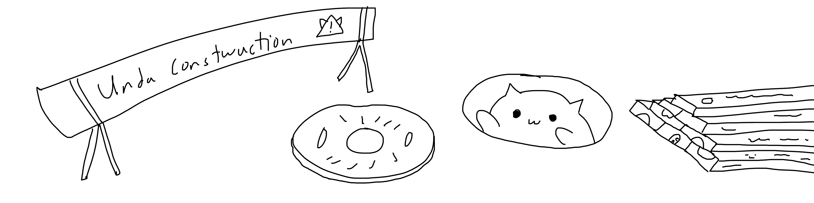

# Project Name
The Project Scope - Lorem ipsum dolor sit amet, consectetur adipiscing elit. Ut viverra interdum nisi. In hac habitasse platea dictumst. Integer tincidunt, felis a pellentesque scelerisque, turpis sapien lacinia lectus, eu ultricies nibh leo mollis metus. Nullam a velit condimentum, tempor felis sit amet, euismod lectus. Phasellus sed orci a lectus placerat lacinia sed ac magna. Pellentesque quis mollis dolor. Suspendisse vel imperdiet mauris, a aliquam urna. Ut mattis risus nec sem tincidunt, ac facilisis sem fringilla. Praesent placerat vehicula euismod. Suspendisse volutpat massa id massa facilisis porta.

## Required tools (for docs & project files)

- **Main diagrams app (diagrams.net / draw.io desktop)**: use the latest release from [drawio-desktop releases](https://github.com/jgraph/drawio-desktop/releases/).
- **PureRef (image board / reference)**: download from [PureRef downloads](https://www.pureref.com/download.php).
- **KiCad (electronics design / schematics / PCB)**: download from [KiCad stable downloads (Windows)](https://downloads.kicad.org/kicad/windows/explore/stable#cat-12-1).
- **LibreOffice (docs/spreadsheets)**: download from [LibreOffice downloads](https://www.libreoffice.org/download/) (local install recommended).

### Keeping a local copy (without bloating the repo)

Because installers can be 100–300MB+, it’s best to **not commit them into git history**. Good options:

- **Preferred**: keep a `tools-cache/` folder **ignored by git**, and store installers locally there.
- **Shareable “local copy”**: attach installers to a **GitHub Release** (release assets support large files), or keep a separate “tools” repo.
- **Alternative**: use **Git LFS** for large binaries (works, but adds LFS setup/quotas and still grows storage).

## Features

- Some Mentionable Features that the Project focuses on

## [Hardware](/Hardware/README.md)

Hardware Overview - Lorem ipsum dolor sit amet, consectetur adipiscing elit. Ut viverra interdum nisi. In hac habitasse platea dictumst. Integer tincidunt, felis a pellentesque scelerisque, turpis sapien lacinia lectus, eu ultricies nibh leo mollis metus. Nullam a velit condimentum, tempor felis sit amet, euismod lectus. Phasellus sed orci a lectus placerat lacinia sed ac magna. Pellentesque quis mollis dolor. Suspendisse vel imperdiet mauris, a aliquam urna. Ut mattis risus nec sem tincidunt, ac facilisis sem fringilla. Praesent placerat vehicula euismod. Suspendisse volutpat massa id massa facilisis porta.

## [Software](/Software/README.md)

Software Overview - Lorem ipsum dolor sit amet, consectetur adipiscing elit. Ut viverra interdum nisi. In hac habitasse platea dictumst. Integer tincidunt, felis a pellentesque scelerisque, turpis sapien lacinia lectus, eu ultricies nibh leo mollis metus. Nullam a velit condimentum, tempor felis sit amet, euismod lectus. Phasellus sed orci a lectus placerat lacinia sed ac magna. Pellentesque quis mollis dolor. Suspendisse vel imperdiet mauris, a aliquam urna. Ut mattis risus nec sem tincidunt, ac facilisis sem fringilla. Praesent placerat vehicula euismod. Suspendisse volutpat massa id massa facilisis porta.

## [Embedded](/Embedded/README.md)

Embedded Overview - Lorem ipsum dolor sit amet, consectetur adipiscing elit. Ut viverra interdum nisi. In hac habitasse platea dictumst. Integer tincidunt, felis a pellentesque scelerisque, turpis sapien lacinia lectus, eu ultricies nibh leo mollis metus. Nullam a velit condimentum, tempor felis sit amet, euismod lectus. Phasellus sed orci a lectus placerat lacinia sed ac magna. Pellentesque quis mollis dolor. Suspendisse vel imperdiet mauris, a aliquam urna. Ut mattis risus nec sem tincidunt, ac facilisis sem fringilla. Praesent placerat vehicula euismod. Suspendisse volutpat massa id massa facilisis porta.

## Roadmap

- Milestones: Things I've Completed/Achieved within the project
- Work In Progress: Things I'm Working on at the moment or havent completed yet
- Planned: Things that are planned for the future

